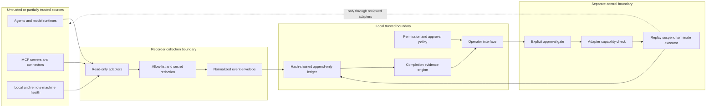

# Threat model and trust boundaries

## Protected assets

- agent, model, MCP, connector, and tool inventory
- permission grants and human approval evidence
- ordered action/evidence events and completion verdicts
- control requests and receipts
- local configuration paths and infrastructure metadata

## Adversaries and failure modes

The recorder assumes a compromised or malfunctioning agent may omit, forge, reorder, or overstate events. A source adapter may be stale, malicious, or simply incompatible. A local user may alter the ledger after collection. An operator may attempt a control without adequate authority. Responses can contain secrets or adversarial text. Network probes can hang or return partial state.

## Trust-boundary diagram

## Required controls

- Collection is read-only, bounded by timeouts, and stores allow-listed summaries rather than source bodies.
- Keys matching credential, token, cookie, authorization, password, or secret patterns are rejected before persistence.
- Each ledger event includes a prior hash and its own SHA-256 hash. This detects modification; it is not yet external notarization.
- Source failure is an event, never silently dropped.
- Completion verdicts include claim, proof, uncertainty, and source freshness.
- Control defaults to denied. Approval, adapter-declared capability, target identity, idempotency key, timeout, and receipt are required.
- A timeout produces `unknown`, not `success`. Termination never falls back to an undisclosed blind process kill.
- The first live adapter owns the process it controls, addresses it by an unpredictable target id, exposes no PID or command input, binds to loopback, and requires an expiring single-use nonce whose hash—not raw value—is persisted.

## Residual risk

An administrator with filesystem access can replace both ledger and verifier. The MVP does not provide hardware-backed identity, external timestamping, multi-party approval, or cryptographic signatures from source systems. Those are enterprise hardening candidates after the local vertical slice earns demand.
