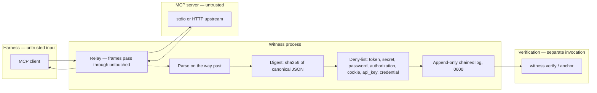

# Threat model and trust boundaries

Scope: the Witness recorder — the stdio and HTTP proxies, the per-session log, and the CLI that verifies and reads it. Nothing else.

## Protected assets

- the ordered record of tool calls and outcomes per session
- the integrity of each session's chain and of the checkpoint chain
- the declared principal and client identity attached to each call
- the confidentiality of everything Witness deliberately does not store: arguments, results, headers, environment

## Adversaries and failure modes

- **A compromised or malfunctioning agent** may issue calls it should not, omit calls, or flood the relay. Witness records what crossed the boundary; it cannot see calls that bypass the wrapped server.
- **A malicious or broken MCP server** may answer late, never, out of order, with non-JSON, or with adversarial text in results. Every case is a recorded outcome (`error`, `unknown`, `raw`), never a dropped frame.
- **A local user with write access to `WITNESS_HOME`** may edit, truncate, reorder, or delete records after the fact.
- **A user who controls the harness config** may unwrap a server, point a config at an unrecorded copy, or run the server directly.
- **The recorder itself** may fail to write (disk full, permissions, crash).

## Trust-boundary diagram

## Controls in this version

- **Relay before record.** The frame is forwarded before it is parsed. A parse or write failure is written to stderr and the relay continues.
- **Digest, not store.** `args_sha256` and `result_sha256` are the SHA-256 of canonical JSON. Plaintext appears only in `args_summary`, only for keys the operator allow-lists, never for keys matching the deny-list, truncated to 120 characters.
- **Headers are never recorded.** The HTTP proxy forwards `Authorization` and every other header unchanged and records none of them.
- **Every record carries `prev` and `hash`.** `hash = sha256(canonical(record) + prev)`. Editing any record breaks verification at that record; deleting a record breaks it at the next; truncating the tail is detectable only by comparing the head against a checkpoint or anchor.
- **Unanswered is `unknown`.** A call the server never answered is sealed as `unknown` at session end, never as `ok` and never omitted.
- **Files are `0600`, the directory `0700`.**
- **The command line is digested.** `server.cmd_sha256` in `session_start` makes a substituted binary visible across sessions.
- **Verification is a separate process** with no shared state with the recorder beyond the files.

## Residual risk

- An administrator with filesystem access can rewrite a log and rewrite the verifier. A chain proves internal consistency, not provenance. `anchor --git` gives a third-party clock only to the extent the git repository is one; external timestamping is not implemented.
- The principal is declared (`verified: false`). Nothing in this version binds a record to a person or a device.
- Only wrapped servers are observed. Witness cannot enumerate what was not wrapped, and says so.
- Timing side channels: `ms` and `args_bytes` / `result_bytes` are recorded and can reveal something about the content they digest. Operators handling sensitive tools should treat the log as confidential.
- A server that writes JSON-RPC across multiple lines, or a client that does, is recorded as `raw` and not classified.
