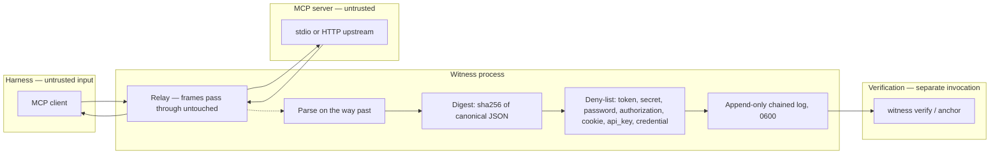

# Threat model and trust boundaries

Scope: the Witness recorder — the stdio and HTTP proxies, the per-session log, and the CLI that verifies and reads it. The feed relay has its own section at the end.

## Protected assets

- the ordered record of tool calls and outcomes per session
- the integrity of each session's chain and of the checkpoint chain
- the declared principal and client identity attached to each call
- the confidentiality of everything Witness deliberately does not store: arguments, results, headers, environment

## Adversaries and failure modes

- **A compromised or malfunctioning agent** may issue calls it should not, omit calls, or flood the relay. Witness records what crossed the boundary; it cannot see calls that bypass the wrapped server.
- **A malicious or broken MCP server** may answer late, never, out of order, with non-JSON, or with adversarial text in results. Every case is a recorded outcome (`error`, `unknown`, `raw`), never a dropped frame.
- **A local user with write access to `WITNESS_HOME`** may edit, truncate, reorder, or delete records after the fact.
- **A user who controls the harness config** may unwrap a server, point a config at an unrecorded copy, or run the server directly.
- **The recorder itself** may fail to write (disk full, permissions, crash).

## Trust-boundary diagram

```mermaid
flowchart LR
  subgraph H[Harness — untrusted input]
    C[MCP client]
  end
  subgraph W[Witness process]
    R[Relay — frames pass through untouched]
    P[Parse on the way past]
    D[Digest: sha256 of canonical JSON]
    X[Deny-list: token, secret, password, authorization, cookie, api_key, credential]
    L[Append-only chained log, 0600]
  end
  subgraph S[MCP server — untrusted]
    M[stdio or HTTP upstream]
  end
  subgraph V[Verification — separate invocation]
    K[witness verify / anchor]
  end
  C --> R --> M
  M --> R --> C
  R -.-> P --> D --> X --> L
  L --> K
```

## Controls in this version

- **Relay before record.** The frame is forwarded before it is parsed. A parse or write failure is written to stderr and the relay continues.
- **Digest, not store.** `args_sha256` and `result_sha256` are the SHA-256 of canonical JSON. Plaintext appears only in `args_summary`, only for keys the operator allow-lists, never for keys matching the deny-list, truncated to 120 characters.
- **Headers are never recorded.** The HTTP proxy forwards `Authorization` and every other header unchanged and records none of them.
- **Every record carries `prev` and `hash`.** `hash = sha256(canonical(record) + prev)`. Editing any record breaks verification at that record; deleting a record breaks it at the next; truncating the tail is detectable only by comparing the head against a checkpoint or anchor.
- **Unanswered is `unknown`.** A call the server never answered is sealed as `unknown` at session end, never as `ok` and never omitted.
- **Files are `0600`, the directory `0700`.**
- **The command line is digested.** `server.cmd_sha256` in `session_start` makes a substituted binary visible across sessions.
- **Verification is a separate process** with no shared state with the recorder beyond the files.

## Residual risk

- An administrator with filesystem access can rewrite a log and rewrite the verifier. A chain proves internal consistency, not provenance. `anchor --git` gives a third-party clock only to the extent the git repository is one; external timestamping is not implemented.
- The principal is declared (`verified: false`). Nothing in this version binds a record to a person or a device.
- Only wrapped servers are observed. Witness cannot enumerate what was not wrapped, and says so.
- Timing side channels: `ms` and `args_bytes` / `result_bytes` are recorded and can reveal something about the content they digest. Operators handling sensitive tools should treat the log as confidential.
- A server that writes JSON-RPC across multiple lines, or a client that does, is recorded as `raw` and not classified.

## The feed relay

Scope: `witness keygen`, `witness feed publish`, `witness feed serve` and `witness feed pull`, the signed relay of refusal indicators between Witness homes ([SPEC-0.2.md](../SPEC-0.2.md) section 5). The council gate that reads the feed belongs to the council mod, not to this package.

### Protected assets

- the integrity of each peer's published chain and of every remote copy of it
- the rule that only records signed by a trusted peer key enter a remote copy
- the private key in `keys/<key_id>.key`

### Trusted keys

- A peer is trusted only when its `.pub` is in `keys/`. The operator copies it there. Pull never fetches a key, and it never trusts a key because a reply names it.
- `key_id` is a name, not a trust anchor. It holds 32 bits of the key digest, so an attacker can make a different key with the same `key_id`. Pull checks every signature with the content of `keys/<key_id>.pub`, and that file must hash to its `key_id`. Compare the whole `.pub` content, not only the `key_id`, when you accept a peer key.
- `keys/` is 0700 and its files are 0600.

### Adversaries and controls

- **A server that lies**, or anything on the network path, because the feed is plain HTTP. It can edit, forge, reorder, insert or drop lines. Every line must carry a valid signature from the trusted key of that peer, its hash must recompute with `signer` removed, and its `seq` and `prev` must continue the local copy. Pull stops at the first bad line, keeps the lines before it, appends nothing after it, and exits 3. One reply holds one `key_id`, and `feed/remote/peers.json` binds each URL to its key, so a server cannot switch a URL to another trusted key.
- **Replay and gaps.** A replayed line has a `seq` that does not continue the copy. A dropped line leaves a gap in `seq`. A reordered line breaks `prev`. Each case stops the pull with exit 3.
- **A peer that rewrites its own history** and signs it again from an earlier `seq`. Its next new line does not continue the copy by `prev`, so pull exits 3. The puller keeps the original lines.
- **An edit to a line that the puller already holds.** Pull asks only for the lines after its last `seq`, so it does not see that edit. Its copy keeps the signed original. `witness verify` on the publisher finds the edit.
- **A peer key compromise.** Whoever holds a peer's `.key` can sign any feed record as that peer. Every home that trusts the peer then refuses calls whose indicator digest matches. A forged entry can cause a refusal, not a run: the gate only adds a refusing vote. To recover, delete the peer's `.pub` from `keys/`, delete `feed/remote/<key_id>.jsonl`, and remove the URL from `feed/remote/peers.json`. There is no revocation list and no key rotation.
- **A local key compromise.** Whoever reads `keys/<key_id>.key` can sign as this home. The file is 0600, and Witness never sends it anywhere.
- **A server that floods.** Pull reads at most 32 MiB and waits at most 30 seconds. Then it exits 1 and appends nothing.
- **A client that probes the server.** The server answers only `GET /feed`. Every other path gives 404 and every other method on `/feed` gives 405. It has no write endpoint and reads only `feed/published.jsonl`. It binds only to `--host`, default `127.0.0.1`.
- **A local user who swaps `published.jsonl` for a link**, for example a symbolic link or a hard link to `keys/<key_id>.key`. The server opens the file with `O_NOFOLLOW` and `O_NONBLOCK`, and it serves only a regular file with one hard link. A link, a directory or a FIFO gives 500 and no file bytes.
- **A client that exhausts the server.** The server streams each reply with backpressure and never reads the whole file into memory. A reply holds at most 32 MiB of whole lines. At most 8 replies run at once, and a ninth request gets 503. A socket with no traffic for 30 seconds is destroyed, and a request must arrive in 30 seconds.
- **A new URL that names a copied key.** Pull sends one request for the whole feed. The lines that overlap the local copy must be byte-identical to it, and every new line must verify and continue the chain. Any difference stops the pull with exit 3 and appends nothing after it.
- **A reply that trips the checker.** A last line with no newline fails. An exception while a line is checked, for example a record nested too deep to hash, fails that line. Both keep the lines before it and exit 3.
- **A forged or broken feed file on disk.** `witness feed match` counts a hit only from a file that verifies: a valid chain, signed by a trusted key where the file needs a signer, and for a remote copy signed by the key in its file name. A file that does not verify, or cannot be read, gives exit 2.
- **A broken or stripped local chain.** publish verifies `feed/refusals.jsonl` and `feed/published.jsonl` first. If either is broken, it publishes nothing and exits 3. The hash does not cover `signer`, so a signed chain requires a signer on every record, and a stripped signer fails.

### Residual risk

- A server can withhold new records. A puller cannot tell a quiet peer from a server that hides records.
- The feed has no TLS and no authentication. Anyone on the network path can read it. Bind to loopback, or carry the feed over SSH or a VPN.
- The gate does not verify signatures again. A local user who can write `feed/remote/` can add entries. That user can also write `keys/`, so this is the local-user risk above, and a forged entry causes refusals only.
- An indicator digest of a short or common value, such as a domain or a tool name, can be reversed by guessing.
- `O_NOFOLLOW` checks only the last part of the path. A link at `feed/` or above is followed. Making such a link needs write access to `WITNESS_HOME`, which is the local-user risk above.
